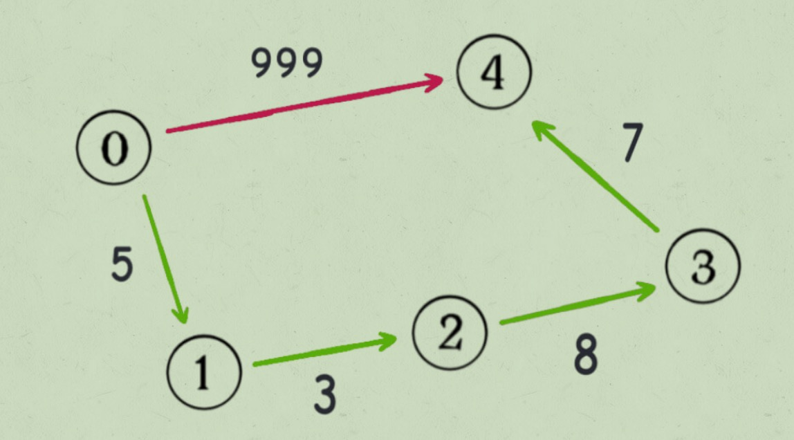

### 303.「区域和检索 - 数组不可变

### 21. 合并两个有序列表


### 19. 移除链表倒数第K个节点


### 142.环形链表 II

 
 我们假设快慢指针相遇时，慢指针 slow ⾛了 k 步，那么快指针 fast ⼀定⾛了 2k 步：
 fast ⼀定⽐ slow 多⾛了 k 步，这多⾛的 k 步其实就是 fast 指针在环⾥转圈圈，所以 k 的值就是环⻓度 的「整数倍」。 假设相遇点距环的起点的距离为 m，那么结合上图的 slow 指针，环的起点距头结点 head 的距离为 k -
 m，也就是说如果从 head 前进 k - m 步就能到达环起点。 巧的是，如果从相遇点继续前进 k - m 步，也恰好到达环起点。因为结合上图的 fast 指针，从相遇点开始 ⾛k步可以转回到相遇点，那⾛ k - m 步肯定就⾛到环起点了：


强烈建议了解单调栈 

```java
public int [] nextGreaterElement(int [] nums){
  	if(null == nums || nums.length <= 0){
      	return null;
    }
  	int length = nums.length;
  	//核心结构
  	Stack<Integer> stack = new Stack<>();
    for(int i = length -1;i >= 0;i--){
      	while(!stack.isEmpty() && stack.peek() <= nums[i]){
          	//移除小个子
          	stack.pop();
        }
      	res[i] = stack.isEmpty()?-1:stack.peek();
        stack.push(nums[i]);
    }
}
```
__
首先解决单调栈的变种 739.每日温度   计算下一个更大值 与 当前值的 的索引差 直接看实现

```java
public int[] dailyTemperatures(int[] temperatures) {
  	if(null == temperatures || temperatures.length <= 0){
      	return null;
    }
  	int length = temperatures.length();
  	Stack<Integer> stack = new Stack<>();
  	int [] res = new int[length];
  	for(int i = length -1;i >=0 ; i--){
      	while(!stack.isEmpty() && nums[stack.peek()] <= temperatures[i]){
           stack.pop();
        }
      	//计算最大值 距离当前索引位置差
      	res[i] = stack.isEmpty()?0:(stack.peek()-i);
      	//存入索引比对
     		stack.push(i); 	
    }
  	return res;
}
```

单调栈变种2    503.下一个更大元素 II  注意这个是循环搜索 解题思路 就是环形数组 

平常环形数组 索引 % 数组长度  索引一直在变 增加或者减少

我们将数组翻倍 同时 使用索引 % 数组长度 使用单调栈来解

```java
public int[] nextGreaterElements(int[] nums) {
  	if(null == nums || nums.length <= 0){
      	return null;
    }
  	int length = nums.length;
  	Stack<Integer> stack = new Stack<>();
  	int [] res = new int [length];
  	for(int i = length * 2 -1;i>=0;i++){
      	while(!stack.isEmpty() && stack.peek() <= nums[i % length]){
          	stack.pop();
        }
      	res[i % length ] = stack.isEmpty()?-1: stack.peek();
      	stack.push(nums[i%length]);
    }
  	return res;
}
```

单调栈变种3  回到这里 496.下一个更大元素 I

首先转化下思路 我们一个数组 会求这个数组的下一个大值  那我们两个数组 求第一个数组中元素 在第二个数组中的大值

我们先求第二个数组中的每个元素 对应的下一个更大元素 然后在循环第一个数组 挨个获取前面保存的元素的最大的 不存在则为-1了

```java
public int[] nextGreaterElement(int[] nums1, int[] nums2) {
    if(null == nums2 || nums2.length <= 0){
      return null;
    }
    if(null == nums1){
      return null;
    }
  	int length = nums1.length;
  	int [] res = new int[length];
  	//获取nums2中每个元素 对应的下一个更大元素
  	Map<Integer,Integer> map = getNextGreaterElement(nums2);
  	for(int i =0; i<length ;i++){
      	res[i] = map.getOrDefault(nums[i],-1);
    }
  	return res;
}

private Map<Integer,Integer> getNextGreaterElement(int [] nums){
		int length = nums.length;
  	Stack<Integer> stack = new Stack<>();
  	Map<Integer,Integer> map = new HashMap<>(16);
  	for(int i = length -1;i>=0;i--){
      	while(!stack.isEmpty() && stack.peek() <= nums[i]){
          	stack.pop();
        }
     		map.put(nums[i],stack.peek());
      	stack.push(nums[i]);
    }
  	return map;
}
```

### 239.滑动窗口最大值 


### 710. 黑名单中的随机数
聪明的解法类似上⼀道题，我们可以将区间 [0,N) 看做⼀个数组，然后将 blacklist 中的元素移到数组的 最末尾，同时⽤⼀个哈希表进⾏映射：

如上图，相当于把⿊名单中的数字都交换到了区间 [sz, N) 中，同时把 [0, sz) 中的⿊名单数字映射到了 正常数字。
```java
int last = N - 1;
// 将⿊名单中的索引换到最后去
for (int b : blacklist) {
 mapping[b] = last;
 last--;
}
```
我们将⿊名单中的 b 映射到 last，但是我们能确定 last 不在 blacklist 中吗？ ⽐如下图这种情况，我们的预期应该是 1 映射到 3，但是错误地映射到 4：

在对 mapping[b] 赋值时，要保证 last ⼀定不在 blacklist 中，可以如下操作：
```java
public Solution710(int n, int[] blacklist) {
    mapping = new HashMap<>();
    //实际有效数组长度
    sz = n - blacklist.length;
    //记录下黑名单内的元素
    for (int num : blacklist) {
        mapping.put(num, 888);
    }
    //最大索引位置
    int last = n - 1;
    //更新黑名单元素索引
    for (int num : blacklist) {
        //跳过mapping中包含的元素
        while (mapping.containsKey(last)) {
            last--;
        }
        //将元素存入mapping
        mapping.put(num, last);
        //更新最大索引位
        last--;
    }
}
```
问题2 第⼆个问题，如果 blacklist 中的⿊名单数字本身就存在区间 [sz, N) 中，那么就没必要在 mapping 中 建⽴映射，⽐如这种情况：

```java
public Solution710(int n, int[] blacklist) {
    mapping = new HashMap<>();
    //实际有效数组长度
    sz = n - blacklist.length;
    //记录下黑名单内的元素
    for (int num : blacklist) {
        mapping.put(num, 888);
    }
    //最大索引位置
    int last = n - 1;
    //更新黑名单元素索引
    for (int num : blacklist) {
        if (num >= sz) {
            //黑名单内元素 已经在有效索引范围之外 不管他
            continue;
        }
        //跳过mapping中包含的元素
        while (mapping.containsKey(last)) {
            last--;
        }
        //将元素存入mapping
        mapping.put(num, last);
        //更新最大索引位
        last--;
    }
}
```
⾄此，这道题也解决了，总结⼀下本⽂的核⼼思想： 
1、如果想⾼效地，等概率地随机获取元素，就要使⽤数组作为底层容器。 
2、如果要保持数组元素的紧凑性，可以把待删除元素换到最后，然后 pop 掉末尾的元素，
这样时间复杂度 就是 O(1) 了。当然，我们需要额外的哈希表记录值到索引的映射。
 3、对于第⼆题，数组中含有「空洞」（⿊名单数字），也可以利⽤哈希表巧妙处理映射关系，让数组在逻辑 上是紧凑的，⽅便随机取元素。
 
 前⽂ ⼆叉树就那⼏个框架 写过，这样的遍历顺序差异，导致了 preorder 和 inorder 数组中的元素分布有 如下特点：
 
 ```java
private List<Integer> preorder = new ArrayList<>(), inorder = new ArrayList<>();

void traverse(TreeNode root) {
    // 前序遍历
    preorder.add(root.val);
    traverse(root.left);
    traverse(root.right);
}

void traverse2(TreeNode root) {
    traverse2(root.left);
    // 中序遍历
    inorder.add(root.val);
    traverse2(root.right);
}
```

中序遍历和后序遍历差异


```java
void traverse(TreeNode root) {
    traverse(root.left);
    traverse(root.right);
    // 后序遍历
    postorder.add(root.val);
}
void traverse(TreeNode root) {
    traverse(root.left);
    // 中序遍历
    inorder.add(root.val);
    traverse(root.right);
}
```
### 105.前序和中序还原二叉树

### 106. 中序和后序还原二叉树 

### 二叉树
BST 是⼀种特殊的⼆叉树，你只要记住它的两个主要特点： 1、左⼩右⼤，即每个节点的左⼦树都⽐当前节点的值⼩，右⼦树都⽐当前节点的值⼤。 2、中序遍历结果是有序的。
1、对于 BST 的每⼀个节点 node，左⼦树节点的值都⽐ node 的值要⼩，右⼦树节点的值都⽐ node 的值 ⼤。2、对于 BST 的每⼀个节点 node，它的左侧⼦树和右侧⼦树都是 BST。

### 96. 不同的二叉搜索树 
### 95. 不同的二叉搜索树 II


### 图

⽤邻接表和邻接矩阵的存储⽅式如下：

邻接表很直观，我把每个节点 x 的邻居都存到⼀个列表⾥，然后把 x 和这个列表关联起来，这样就可以通过 ⼀个节点 x 找到它的所有相邻节点。 邻接矩阵则是⼀个⼆维布尔数组，
我们权且成为 matrix，如果节点 x 和 y 是相连的，那么就把 matrix[x][y] 设为 true（上图中绿⾊的⽅格代表 true）。如果想找节点 x 的邻居，去扫⼀圈 matrix[x][..] 就⾏了。

那么，为什么有这两种存储图的⽅式呢？肯定是因为他们各有优劣。 
对于邻接表，好处是占⽤的空间少。 你看邻接矩阵⾥⾯空着那么多位置，肯定需要更多的存储空间。
但是，邻接表⽆法快速判断两个节点是否相邻。 ⽐如说我想判断节点 1 是否和节点 3 相邻，我要去邻接表⾥ 1 对应的邻居列表⾥查找 3 是否存在。但对于邻 接矩阵就简单了，只要看看 matrix[1][3] 就知道了，效率⾼。 所以说，使⽤哪⼀种⽅式实现图，要看具体情况。 
好了，对于「图」这种数据结构，能看懂上⾯这些就绰绰够⽤了。 那你可能会问，我们这个图的模型仅仅是「有向⽆权图」，不是还有什么加权图，⽆向图，等等…… 其实，这些更复杂的模型都是基于这个最简单的图衍⽣出来的。 有向加权图怎么实现？很简单呀： 如果是邻接表，
我们不仅仅存储某个节点 x 的所有邻居节点，还存储 x 到每个邻居的权重，不就实现加权有 向图了吗？ 如果是邻接矩阵，matrix[x][y] 不再是布尔值，⽽是⼀个 int 值，0 表示没有连接，其他值表示权重，不 就变成加权有向图了吗？⽆向图怎么实现？也很简单，所谓的「⽆向」，是不是等同于「双向」？

如果连接⽆向图中的节点 x 和 y，把 matrix[x][y] 和 matrix[y][x] 都变成 true 不就⾏了；邻接表也 是类似的操作。 把上⾯的技巧合起来，就变成了⽆向加权图……
### 图遍历框架
```java
/* 多叉树遍历框架 */
void traverse(TreeNode root) {
    if (root == null) return;
    for (TreeNode child : root.children)
     traverse(child);
}
//如果图包含环，遍历框架就要⼀个 visited 数组进⾏辅助：

boolean[] visited;
/* 图遍历框架 */
void traverse(Graph graph, int s) {
    if (visited[s]) return;
    // 经过节点 s
     visited[s] = true;
    for (int neighbor : graph.neighbors(s))
     traverse(graph, neighbor);
    // 离开节点 s
     visited[s] = false; 
}

```

### 210. 课程表 II


后序遍历的反转即为拓扑排序
有图的图 无法进行拓扑排序
那么为什么后序遍历的反转结果就是拓扑排序呢？ 我这⾥也避免数学证明，
⽤⼀个直观地例⼦来解释，我们就说⼆叉树，这是我们说过很多次的⼆叉树遍历框架：

```java
void traverse(TreeNode root) {
    // 前序遍历代码位置
     traverse(root.left)
    // 中序遍历代码位置
     traverse(root.right)
    // 后序遍历代码位置 
}
```
⼆叉树的后序遍历是什么时候？遍历完左右⼦树之后才会执⾏后序遍历位置的代码。
换句话说，当左右⼦树 的节点都被装到结果列表⾥⾯了，根节点才会被装进去。 
后序遍历的这⼀特点很重要，之所以拓扑排序的基础是后序遍历，是因为⼀个任务
必须在等到所有的依赖任 务都完成之后才能开始开始执⾏。 你把每个任务理解成
⼆叉树⾥⾯的节点，这个任务所依赖的任务理解成⼦节点，那你是不是应该先把所有⼦
节点处理完再处理⽗节点？这是不是就是后序遍历？

再说⼀说为什么还要把后序遍历结果反转，才是最终的拓扑排序结果。 我们说⼀个节点
可以理解为⼀个任务，这个节点的⼦节点理解为这个任务的依赖，但你注意我们之前说的依 
赖关系的表示：如果做完 A 才能去做 B，那么就有⼀条从 A 指向 B 的有向边，表示 B 依赖 A。
 那么，⽗节点依赖⼦节点，体现在⼆叉树⾥⾯应该是这样的：
 
 是不是和我们正常的⼆叉树指针指向反过来了？所以正常的后序遍历结果应该进⾏反转，才是拓扑排序的结果。
 
 ⼆分图简介 
 在讲⼆分图的判定算法之前，我们先来看下百度百科对「⼆分图」的定义： 
 ⼆分图的顶点集可分割为两个互不相交的⼦集，图中每条边依附的两个顶点都分属于这两个⼦集，且两个⼦集内的顶点不相邻。
 
 来玩个游戏吧： 
 给你⼀幅「图」，请你⽤两种颜⾊将图中的所有顶点着⾊，且使得任意⼀条边的两个端点的颜⾊都不相同， 你能做到吗？
 这就是图的「双⾊问题」，其实这个问题就等同于⼆分图的判定问题，如果你能够成功地将图染⾊，那么这 幅图就是⼀幅⼆分图，反之则不是：
 
 在具体讲解⼆分图判定算法之前，我们先来说说计算机⼤佬们闲着⽆聊解决双⾊问题的⽬的是什么。 
 ⾸先，⼆分图作为⼀种特殊的图模型，会被很多⾼级图算法（⽐如最⼤流算法）⽤到，不过这些⾼级算法我 们不是特别有必要去掌握，有兴趣的读者可以⾃⾏搜索。 
 从简单实⽤的⻆度来看，⼆分图结构在某些场景可以更⾼效地存储数据。
 ⽐如前⽂ 介绍《算法 4》 ⽂章中的例⼦，如何存储电影演员和电影之间的关系？
 如果⽤哈希表存储，需要两个哈希表分别存储「每个演员到电影列表」的映射和「每部电影到演员列表」的 映射。 
 但如果⽤「图」结构存储，将电影和参演的演员连接，很⾃然地就成为了⼀幅⼆分图：
 
 每个电影节点的相邻节点就是参演该电影的所有演员，每个演员的相邻节点就是该演员参演过的所有电影， ⾮常⽅便直观。 
 类⽐这个例⼦，其实⽣活中不少实体的关系都能⾃然地形成⼆分图结构，所以在某些场景下图结构也可以作 为存储键值对的数据结构（符号表）。
 ### 图的遍历
 ```java
//二叉树
void traverse(TreeNode root){
    if(null == root){
        return;
    } 
    traverse(root.left);
    traverse(root.right);
}

void traverse(Node root){
    if(null == root){
        return;
    } 
    for(Node node:root.children){
        traverse(node);
    }
}

boolean [] visited;

void traverse(Graph graph,int s){
    if(visited[s]){
        return;
    }
    visited[s] = true;
    for(TreeNode node: graph.neighbors(v)){
        traverse(graph,node);
    }
}
```

### 785. 判断二分图
### 886. 可能的二分法
二分图判定问题
- 增加visited 访问标记数组 以及 color颜色数组 ok是否为二分图
- 构造图 构造有向图或者 无向图 785为 有向图 886 为无向图
- 递归 没有被访问的情况进行递归 
- 二分图标记为false 直接return
- 增加访问标记
- 判断当前节点的相邻节点是否被访问 被访问 进行判断颜色 没有被访问 则进行上色 在进行递归 相邻节点和 相邻节点的相邻接点

### UNION-FIND
今天讲讲 Union-Find 算法，也就是常说的并查集算法，主要是解决图论中「动态连通性」问题的。
先解释⼀下什么叫动态连通性吧。
 ⼀、问题介绍 简单说，动态连通性其实可以抽象成给⼀幅图连线。
 ⽐如下⾯这幅图，总共有 10 个节点，他们互不相连，分 别⽤ 0~9标记：
 
 现在我们的 Union-Find 算法主要需要实现这两个 API：
 ```java
class UF {
    /* 将 p 和 q 连接 */
    public void union(int p, int q);
    /* 判断 p 和 q 是否连通 */
    public boolean connected(int p, int q);
    /* 返回图中有多少个连通分量 */
    public int count(); 
}
```
这⾥所说的「连通」是⼀种等价关系，也就是说具有如下三个性质： 
1、⾃反性：节点 p 和 p 是连通的。
 2、对称性：如果节点 p 和 q 连通，那么 q 和 p 也连通。 
 3、传递性：如果节点 p 和 q 连通，q 和 r 连通，那么 p 和 r 也连通。
 ⽐如说之前那幅图，0～9 任意两个不同的点都不连通，调⽤ connected 都会返回 false，连通分量为 10 个。
 如果现在调⽤ union(0, 1)，那么 0 和 1 被连通，连通分量降为 9 个。 
 再调⽤ union(1, 2)，这时 0,1,2 都被连通，调⽤ connected(0, 2) 也会返回 true，连通分量变为 8 个。
 
 判断这种「等价关系」⾮常实⽤，⽐如说编译器判断同⼀个变量的不同引⽤，⽐如社交⽹络中的朋友圈计算 等等。 
 这样，你应该⼤概明⽩什么是动态连通性了，Union-Find 算法的关键就在于 union 和 connected 函数的效率。
 那么⽤什么模型来表示这幅图的连通状态呢？⽤什么数据结构来实现代码呢？
 
 ###
 
 
 ### 130. 被围绕的区域
 给你一个 m x n 的矩阵 board ，由若干字符 'X' 和 'O' ，找到所有被 'X' 围绕的区域，并将这些区域里所有的 'O' 用 'X' 填充。
 
 解决这个问题的传统⽅法也不困难，先⽤ for 循环遍历棋盘的四边，⽤ DFS 算法把那些与边界相连的 O 换成 ⼀个特殊字符，
 ⽐如 #；然后再遍历整个棋盘，把剩下的 O 换成 X，把 # 恢复成 O。这样就能完成题⽬的要 求，时间复杂度 O(MN)。 
 这个问题也可以⽤ Union-Find 算法解决，虽然实现复杂⼀些，甚⾄效率也略低，但这是使⽤ Union-Find 算 法的通⽤思想，值得⼀学。 
 你可以把那些不需要被替换的 O 看成⼀个拥有独⻔绝技的⻔派，它们有⼀个共同祖师爷叫 dummy，这些 O 和
 dummy 互相连通，⽽那些需要被替换的 O 与 dummy 不连通。
 
 ⾸先要解决的是，根据我们的实现，Union-Find 底层⽤的是⼀维数组，构造函数需要传⼊这个数组的⼤⼩， ⽽题⽬给的是⼀个⼆维棋盘。
  这个很简单，⼆维坐标 (x,y) 可以转换成 x * n + y 这个数（m 是棋盘的⾏数，n 是棋盘的列数）。敲⿊板，这是将⼆维坐标映射到⼀维的常⽤技巧。
 其次，我们之前描述的「祖师爷」是虚构的，需要给他⽼⼈家留个位置。索引 [0.. m*n-1] 都是棋盘内坐 标的⼀维映射，那就让这个虚拟的 dummy 节点占据索引 m * n 好了。
 
 
 主要思路是适时增加虚拟节点，想办法让元素「分⻔别类」，建⽴动态连通关系。
 ```java
public static void solve(char[][] board) {
    if (null == board || 0 == board.length) {
        return;
    }

    int m = board.length;
    int n = board[0].length;
    //给dummy虚拟节点留个空位
    Uf uf = new Uf(m * n + 1);
    int dummy = m * n;
    // 将⾸列和末列的 O 与 dummy 连通
    for (int i = 0; i < m; i++) {
        if (board[i][0] == 'O') {
            uf.union(i * n, dummy);
        }
        if (board[i][n - 1] == 'O') {
            uf.union(i * n + n - 1, dummy);
        }
    }
    // 将首行和末行的 O 与 dummy 连通
    for (int j = 0; j < n; j++) {
        if (board[0][j] == 'O') {
            uf.union(j, dummy);
        }
        if (board[m - 1][j] == 'O') {
            uf.union(n * (m - 1) + j, dummy);
        }
    }

    // 方向数组 d 是上下左右搜索的常用手法
    int[][] d = new int[][]{{1, 0}, {0, 1}, {0, -1}, {-1, 0}};
    for (int i = 1; i < m - 1; i++) {
        for (int j = 1; j < n - 1; j++) {
            if (board[i][j] == 'O') {
                // 将此 O 与上下左右的 O 连通{
                for (int k = 0; k < 4; k++) {
                    int x = i + d[k][0];
                    int y = j + d[k][1];
                    if (board[x][y] == 'O') {
                        uf.union(x * n + y, i * n + j);
                    }
                }
            }
        }
    }
    
    for (int i = 1; i < m - 1; i++) {
        for (int j = 1; j < n - 1; j++) {
            if (!uf.connected(dummy, i * n + j)) {
                //虚拟节点 没有和该节点连接 则进行替换
                board[i][j] = 'X';
            }
        }
    }
}
```
 
 使⽤ Union-Find 算法，主要是如何把原问题转化成图的动态连通性问题。对于算式合法性问题，可以直接利 ⽤等价关系，
 对于棋盘包围问题，则是利⽤⼀个虚拟节点，营造出动态连通特性。 另外，将⼆维数组映射到⼀维数组，利⽤⽅向数组 d 来简化代码量，
 都是在写算法时常⽤的⼀些⼩技巧，如果没⻅过可以注意⼀下。
 
 什么是最⼩⽣成树 先说「树」和「图」的根本区别：树不会包含环，图可以包含环。 如果⼀幅图没有环，完全可以拉伸成⼀棵树的模样。
 说的专业⼀点，树就是「⽆环连通图」。 那么什么是图的「⽣成树」呢，其实按字⾯意思也好理解，就是在图中找⼀棵包含图中的所有节点的树。
 专 业点说，⽣成树是含有图中所有顶点的「⽆环连通⼦图」。 容易想到，⼀幅图可以有很多不同的⽣成树，⽐如下⾯这幅图，红⾊的边就组成了两棵不同的⽣成树
 
 对于加权图，每条边都有权重，所以每棵⽣成树都有⼀个权重和。⽐如上图，右侧⽣成树的权重和显然⽐左 侧⽣成树的权重和要⼩。 
 那么最⼩⽣成树很好理解了，所有可能的⽣成树中，权重和最⼩的那棵⽣成树就叫「最⼩⽣成树」。 
 PS：⼀般来说，我们都是在⽆向加权图中计算最⼩⽣成树的，所以使⽤最⼩⽣成树算法的现实场景 中，图的边权重⼀般代表成本、距离这样的标量。
 
 Kruskal 算法
 所谓最小生成树，就是图中若干边的集合（我们后文称这个集合为mst，最小生成树的英文缩写），你要保证这些边：
 
 1、包含图中的所有节点。
 
 2、形成的结构是树结构（即不存在环）。
 
 3、权重和最小。
 
 有之前题目的铺垫，前两条其实可以很容易地利用 Union-Find 算法做到，关键在于第 3 点，如何保证得到的这棵生成树是权重和最小的。
 
 这里就用到了贪心思路：
 
 将所有边按照权重从小到大排序，从权重最小的边开始遍历，如果这条边和mst中的其它边不会形成环，则这条边是最小生成树的一部分，将它加入mst集合；否则，这条边不是最小生成树的一部分，不要把它加入mst集合。
 
 这样，最后mst集合中的边就形成了最小生成树，下面我们看两道例题来运用一下 Kruskal 算法。
 
 
 比如题目给的例子：
 
 points = [[0,0],[2,2],[3,10],[5,2],[_7,0_]]
 算法应该返回 20，按如下方式连通各点：
 
 
 ### ⼆叉树层级遍历和 BFS 算法
 ```java
// 输⼊⼀棵⼆叉树的根节点，层序遍历这棵⼆叉树
public void levelTraverse(TreeNode root) {
    if (root == null) return;
    Queue<TreeNode> q = new LinkedList<>();
    q.offer(root);
    int depth = 1;
    // 从上到下遍历⼆叉树的每⼀层
    while (!q.isEmpty()) {
        int sz = q.size();
        // 从左到右遍历每⼀层的每个节点
        for (int i = 0; i < sz; i++) {
            TreeNode cur = q.poll();
            System.out.printf("节点 %s 在第 %s 层", cur, depth);
            // 将下⼀层节点放⼊队列
            if (cur.left != null) {
                q.offer(cur.left);
            }
            if (cur.right != null) {
                q.offer(cur.right);
            }
        }
        depth++;
    }
}
```
### while 循环和 for 循环的配合正是这个遍历框架设计的巧妙之处： 

while 循环控制⼀层⼀层往下⾛，for 循环利⽤ sz 变量控制从左到右遍历每⼀层⼆叉树节点。 
注意我们代码框架中的 depth 变量，其实就记录了当前遍历到的层数。换句话说，每当我们遍历到⼀个节点
cur，都知道这个节点属于第⼏层。
### 基于⼆叉树的遍历框架，我们⼜可以扩展出多叉树的层序遍历框架：
```java
// 输⼊⼀棵多叉树的根节点，层序遍历这棵多叉树
public void levelTraverse(MultiTreeNode root) {
    if (root == null) return;
    Queue<MultiTreeNode> q = new LinkedList<>();
    q.offer(root);
    int depth = 1;
    // 从上到下遍历多叉树的每⼀层
    while (!q.isEmpty()) {
        int sz = q.size();
        // 从左到右遍历每⼀层的每个节点
        for (int i = 0; i < sz; i++) {
            MultiTreeNode cur = q.poll();
            System.out.printf("节点 %s 在第 %s 层", cur, depth);
            // 将下⼀层节点放⼊队列
            for (MultiTreeNode child : cur.children) {
                q.offer(child);
            }
        }
        depth++;
    }
}
```
### 基于多叉树的遍历框架，我们⼜可以扩展出 BFS（⼴度优先搜索）的算法框架：
```java
// 输⼊起点，进⾏ BFS 搜索
int BFS(Node start) {
    // 核⼼数据结构
    Queue<Node> q; 
    // 避免⾛回头路
    Set<Node> visited; 
    // 将起点加⼊队列
    q.offer(start); 
    visited.add(start);
    // 记录搜索的步数
    int step = 0; 
    while (q not empty) {
        int sz = q.size();
        /* 将当前队列中的所有节点向四周扩散⼀步 */
        for (int i = 0; i < sz; i++) {
            Node cur = q.poll();
            printf("从 %s 到 %s 的最短距离是 %s", start, cur, step);
            /* 将 cur 的相邻节点加⼊队列 */
            for (Node x : cur.adj()) {
                if (x not in visited) {
                    q.offer(x);
                    visited.add(x);
                }
            }
        }
        step++;
    }
}
```
如果对 BFS 算法不熟悉，可以看前⽂ BFS 算法框架，这⾥只是为了让你做个对⽐，所谓 BFS 算法，就是把 算法问题抽象成⼀幅「⽆权图」，
然后继续玩⼆叉树层级遍历那⼀套罢了。
注意，我们的 BFS 算法框架也是 while 循环嵌套 for 循环的形式，也⽤了⼀个 step 变量记录 for 循环执 ⾏的次数，
⽆⾮就是多⽤了⼀个 visited 集合记录⾛过的节点，防⽌⾛回头路罢了。

为什么这样呢？ 
所谓「⽆权图」，与其说每条「边」没有权重，不如说每条「边」的权重都是 1，从起点 start 到任意⼀个 节点之间的路径权重就是它们之间「边」的条数，那可不就是 step 变量记录的值么？ 
再加上 BFS 算法利⽤ for 循环⼀层⼀层向外扩散的逻辑和 visited 集合防⽌⾛回头路的逻辑，当你每次从 队列中拿出节点 cur 的时候，从 start 到 cur 的最短权重就是 step 记录的步数。
 但是，到了「加权图」的场景，事情就没有这么简单了，因为你不能默认每条边的「权重」都是 1 了，这个 权重可以是任意正数（Dijkstra 算法要求不能存在负权重边），⽐如下图的例⼦：
 
 想办法去掉 while 循环⾥⾯的 for 循环。 
 为什么？有了刚才的铺垫，这个不难理解，刚才说 for 循环是⼲什么⽤的来着？ 
 是为了让⼆叉树⼀层⼀层往下遍历，让 BFS 算法⼀步⼀步向外扩散，因为这个层数 depth，或者这个步数 step，在之前的场景中有⽤。
 但现在我们想解决「加权图」中的最短路径问题，「步数」已经没有参考意义了，「路径的权重之和」才有 意义，所以这个 for 循环可以被去掉。 
 怎么去掉？就拿⼆叉树的层级遍历来说，其实你可以直接去掉 for 循环相关的代码：
 ```java
// 输⼊⼀棵⼆叉树的根节点，遍历这棵⼆叉树所有节点
void levelTraverse(TreeNode root) {
    if (root == null) return ;
    Queue<TreeNode> q = new LinkedList<>();
    q.offer(root);
    // 遍历⼆叉树的每⼀个节点
    while (!q.isEmpty()) {
        TreeNode cur = q.poll();
        printf("我不知道节点 %s 在第⼏层", cur);
        // 将⼦节点放⼊队列
        if (cur.left != null) {
            q.offer(cur.left);
        }
        if (cur.right != null) {
            q.offer(cur.right);
        }
    }
}
```
但问题是，没有 for 循环，你也没办法维护 depth 变量了。 
如果你想同时维护 depth 变量，让每个节点 cur 知道⾃⼰在第⼏层，可以想其他办法，⽐如新建⼀个 State 类，记录每个节点所在的层数：
```java
class State {
    // 记录 node 节点的深度
    int depth;
    TreeNode node;
    State(TreeNode node, int depth) {
    this.depth = depth;
    this.node = node;
    }
}
// 输⼊⼀棵⼆叉树的根节点，遍历这棵⼆叉树所有节点
void levelTraverse(TreeNode root) {
    if (root == null) return ;
    Queue<State> q = new LinkedList<>();
    q.offer(new State(root, 1));
    // 遍历⼆叉树的每⼀个节点
    while (!q.isEmpty()) {
        State cur = q.poll();
        TreeNode cur_node = cur.node;
        int cur_depth = cur.depth;
        printf("节点 %s 在第 %s 层", cur_node, cur_depth);
        // 将⼦节点放⼊队列
        if (cur_node.left != null) {
            q.offer(new State(cur_node.left, cur_depth + 1));
        }
        if (cur_node.right != null) {
            q.offer(new State(cur_node.right, cur_depth + 1));
        }
    }
}
```
Dijkstra 算法框架 
⾸先，我们先看⼀下 Dijkstra 算法的签名：
```java
// 输⼊⼀幅图和⼀个起点 start，计算 start 到其他节点的最短距离
int[] dijkstra(int start, List<Integer>[] graph);
```
输⼊是⼀幅图 graph 和⼀个起点 start，返回是⼀个记录最短路径权重的数组。 
⽐⽅说，输⼊起点 start = 3，函数返回⼀个 int[] 数组，假设赋值给 distTo 变量，那么从起点 3 到节 点 6 的最短路径权重的值就是 distTo[6]。 
是的，标准的 Dijkstra 算法会把从起点 start 到所有其他节点的最短路径都算出来。 
当然，如果你的需求只是计算从起点 start 到某⼀个终点 end 的最短路径，那么在标准 Dijkstra 算法上稍作修改就可以更⾼效地完成这个需求，这个我们后⾯再说。 
其次，我们也需要⼀个 State 类来辅助算法的运⾏：
```java
class State {
    // 图节点的 id
    int id;
    // 从 start 节点到当前节点的距离
    int distFromStart;
    State(int id, int distFromStart) {
        this.id = id;
        this.distFromStart = distFromStart;
    }
}
```
类似刚才⼆叉树的层序遍历，我们也需要⽤ State 类记录⼀些额外信息，也就是使⽤ distFromStart 变 量记录从起点 start 到当前这个节点的距离。
刚才说普通 BFS 算法中，根据 BFS 的逻辑和⽆权图的特点，第⼀次遇到某个节点所⾛的步数就是最短距离，
所以⽤⼀个 visited 数组防⽌⾛回头路，每个节点只会经过⼀次。
加权图中的 Dijkstra 算法和⽆权图中的普通 BFS 算法不同，在 Dijkstra 算法中，你第⼀次经过某个节点时的 路径权重，不⻅得就是最⼩的，
所以对于同⼀个节点，我们可能会经过多次，⽽且每次的 distFromStart 可能都不⼀样，⽐如下图：

我会经过节点 5 三次，每次的 distFromStart 值都不⼀样，那我取 distFromStart 最⼩的那次，不就是 从起点 start 到节点 5 的最短路径权重了么？
 好了，明⽩上⾯的⼏点，我们可以来看看 Dijkstra 算法的代码模板。 
 其实，Dijkstra 可以理解成⼀个带 dp table（或者说备忘录）的 BFS 算法，伪码如下：
 ```java
// 返回节点 from 到节点 to 之间的边的权重
int weight(int from, int to);
// 输⼊节点 s 返回 s 的相邻节点
List<Integer> adj(int s);
// 输⼊⼀幅图和⼀个起点 start，计算 start 到其他节点的最短距离
int[] dijkstra(int start, List<Integer>[] graph) {
    // 图中节点的个数
    int V = graph.length;
    // 记录最短路径的权重，你可以理解为 dp table
    // 定义：distTo[i] 的值就是节点 start 到达节点 i 的最短路径权重
    int[] distTo = new int[V];
    // 求最⼩值，所以 dp table 初始化为正⽆穷
    Arrays.fill(distTo, Integer.MAX_VALUE);
    // base case，start 到 start 的最短距离就是 0
    distTo[start] = 0;
    // 优先级队列，distFromStart 较⼩的排在前⾯
    Queue<State> pq = new PriorityQueue<>((a, b) -> {
        return a.distFromStart - b.distFromStart;
    });
    // 从起点 start 开始进⾏ BFS
    pq.offer(new State(start, 0));
    while (!pq.isEmpty()) {
        State curState = pq.poll();
        int curNodeID = curState.id;
        int curDistFromStart = curState.distFromStart;
        if (curDistFromStart > distTo[curNodeID]) {
            // 已经有⼀条更短的路径到达 curNode 节点了
            continue;
        }
        // 将 curNode 的相邻节点装⼊队列
        for (int nextNodeID : adj(curNodeID)) {
            // 看看从 curNode 达到 nextNode 的距离是否会更短
            int distToNextNode = distTo[curNodeID] + weight(curNodeID,nextNodeID);
            if (distTo[nextNodeID] > distToNextNode) {
                // 更新 dp table
                distTo[nextNodeID] = distToNextNode;
                // 将这个节点以及距离放⼊队列
                pq.offer(new State(nextNodeID, distToNextNode));
            }
        }
    }
    return distTo;
}
```
对⽐普通的 BFS 算法，你可能会有以下疑问： 
1、没有 visited 集合记录已访问的节点，所以⼀个节点会被访问多次，会被多次加⼊队列，那会不会导致 队列永远不为空，造成死循环？ 
2、为什么⽤优先级队列 PriorityQueue ⽽不是 LinkedList 实现的普通队列？为什么要按照distFromStart 的值来排序？ 
3、如果我只想计算起点 start 到某⼀个终点 end 的最短路径，是否可以修改算法，提升⼀些效率？ 
我们先回答第⼀个问题，为什么这个算法不⽤ visited 集合也不会死循环。 
对于这类问题，我教你⼀个思考⽅法： 
循环结束的条件是队列为空，那么你就要注意看什么时候往队列⾥放元素（调⽤ offer）⽅法，再注意看什 么时候从队列往外拿元素（调⽤ poll ⽅法）。
while 循环每执⾏⼀次，都会往外拿⼀个元素，但想往队列⾥放元素，可就有很多限制了，必须满⾜下⾯这 个条件：
```java
// 看看从 curNode 达到 nextNode 的距离是否会更短
if (distTo[nextNodeID] > distToNextNode) {
    // 更新 dp table
    distTo[nextNodeID] = distToNextNode;
    pq.offer(new State(nextNodeID, distToNextNode));
} 
```

这也是为什么我说 distTo 数组可以理解成我们熟悉的 dp table，因为这个算法逻辑就是在不断的最⼩化 distTo 数组中的元素： 
如果你能让到达 nextNodeID 的距离更短，那就更新 distTo[nextNodeID] 的值，让你⼊队，否则的话对不起，不让⼊队。 
因为两个节点之间的最短距离（路径权重）肯定是⼀个确定的值，不可能⽆限减⼩下去，所以队列⼀定会空，队列空了之后，
distTo 数组中记录的就是从 start 到其他节点的最短距离。 
接下来解答第⼆个问题，为什么要⽤ PriorityQueue ⽽不是 LinkedList 实现的普通队列？ 
如果你⾮要⽤普通队列，其实也没问题的，你可以直接把 PriorityQueue 改成 LinkedList，也能得到正 确答案，但是效率会低很多。
 Dijkstra 算法使⽤优先级队列，主要是为了效率上的优化，类似⼀种贪⼼算法的思路。 
 为什么说是⼀种贪⼼思路呢，⽐如说下⾯这种情况，你想计算从起点 start 到终点 end 的最短路径权重：
 
 你下⼀步想遍历那个节点？就当前的情况来看，你觉得哪条路径更有「潜⼒」成为最短路径中的⼀部分？ 
 从⽬前的情况来看，显然橙⾊路径的可能性更⼤嘛，所以我们希望节点 2 排在队列靠前的位置，优先被拿出 来向后遍历。
 所以我们使⽤ PriorityQueue 作为队列，让 distFromStart 的值较⼩的节点排在前⾯，这就类似我们之 前讲 贪⼼算法 说到的贪⼼思路，
 可以很⼤程度上优化算法的效率。 
 ⼤家应该听过 Bellman-Ford 算法，这个算法是⼀种更通⽤的最短路径算法，因为它可以处理带有负权重边的 图，Bellman-Ford 算法逻辑和 
Dijkstra 算法⾮常类似，⽤到的就是普通队列，本⽂就提⼀句，后⾯有空再具体写。 
接下来说第三个问题，如果只关⼼起点 start 到某⼀个终点 end 的最短路径，是否可以修改代码提升算法 效率。 
肯定可以的，因为我们标准 Dijkstra 算法会算出 start 到所有其他节点的最短路径，你只想计算到 end 的最 短路径，相当于减少计算量，
当然可以提升效率。
需要在代码中做的修改也⾮常少，只要改改函数签名，再加个 if 判断就⾏了：
```java
// 输⼊起点 start 和终点 end，计算起点到终点的最短距离
int dijkstra(int start, int end, List<Integer>[] graph) {
    // ...
    while (!pq.isEmpty()) {
        State curState = pq.poll();
        int curNodeID = curState.id;
        int curDistFromStart = curState.distFromStart;
        // 在这⾥加⼀个判断就⾏了，其他代码不⽤改
        if (curNodeID == end) {
            return curDistFromStart;
        }
        if (curDistFromStart > distTo[curNodeID]) {
            continue;
        }
        // ...
    }
    // 如果运⾏到这⾥，说明从 start ⽆法⾛到 end
    return Integer.MAX_VALUE;
}
```
因为优先级队列⾃动排序的性质，每次从队列⾥⾯拿出来的都是 distFromStart 值最⼩的，所以当你从队 头拿出⼀个节点，如果发现这个节点就
是终点 end，那么 distFromStart 对应的值就是从 start 到 end 的最短距离。 这个算法较之前的实现提前 return 了，所以效率有⼀定的提⾼。
时间复杂度分析 
Dijkstra 算法的时间复杂度是多少？你去⽹上查，可能会告诉你是 O(ElogV)，其中 E 代表图中边的条数，V 代表图中节点的个数。
因为理想情况下优先级队列中最多装 V 个节点，对优先级队列的操作次数和 E 成正⽐，所以整体的时间复杂 度就是 O(ElogV)。 
不过这是理想情况，Dijkstra 算法的代码实现有很多版本，不同编程语⾔或者不同数据结构 API 都会导致算法 的时间复杂度发⽣⼀些改变。

⽐如本⽂实现的 Dijkstra 算法，使⽤了 Java 的 PriorityQueue 这个数据结构，这个容器类底层使⽤⼆叉堆 实现，但没有提供通过索引
操作队列中元素的 API，所以队列中会有重复的节点，最多可能有 E 个节点存在 队列中。 

所以本⽂实现的 Dijkstra 算法复杂度并不是理想情况下的 O(ElogV)，⽽是 O(ElogE)，可能会略⼤⼀些， 因为图中边的条数⼀般是⼤于节点的个数的。
 不过就对数函数来说，就算真数⼤⼀些，对数函数的结果也⼤不了多少，所以这个算法实现的实际运⾏效率 也是很⾼的，以上只是理论层⾯的时间复杂度分析，供⼤家参考。
 
 
### DFS 算法/回溯算法
回溯算法的效率⼀般不⾼，但却是最好⽤的算法。 因为回溯算法就是典型的暴⼒穷举算法嘛，简单粗暴，如果你笔试的时候不会做⼀道题，
那就尝试⽤回溯算法硬上，超时没关系，多少能捞点分回来。
回溯算法是什么？
解决回溯算法相关的问题有什么技巧？如何学习回溯算法？回溯算法代码是否有规律可循？
其实回溯算法其实就是我们常说的 DFS 算法，本质上就是⼀种暴⼒穷举算法。 
废话不多说，直接上回溯算法框架。解决⼀个回溯问题，实际上就是⼀个决策树的遍历过程。
你只需要思考 3 个问题： 
1、路径：也就是已经做出的选择。 
2、选择列表：也就是你当前可以做的选择。 
3、结束条件：也就是到达决策树底层，⽆法再做选择的条件。

回溯算法框架如下：
```java
result = []
def backtrack(路径, 选择列表):
    if 满⾜结束条件:
        result.add(路径)
        return 
    for 选择 in 选择列表: 
        做选择
        backtrack(路径, 选择列表) 
        撤销选择
```
其核⼼就是 for 循环⾥⾯的递归，在递归调⽤之前「做选择」，在递归调⽤之后「撤销选择」，特别简单。


### 51.N皇后问题


